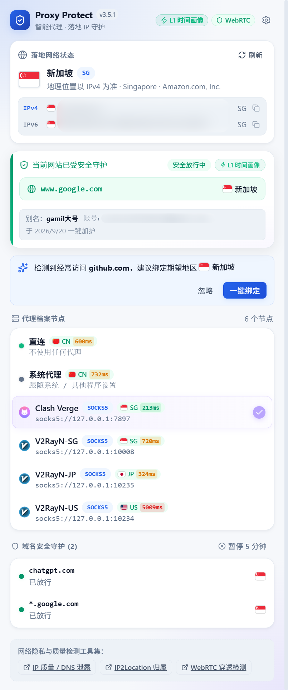
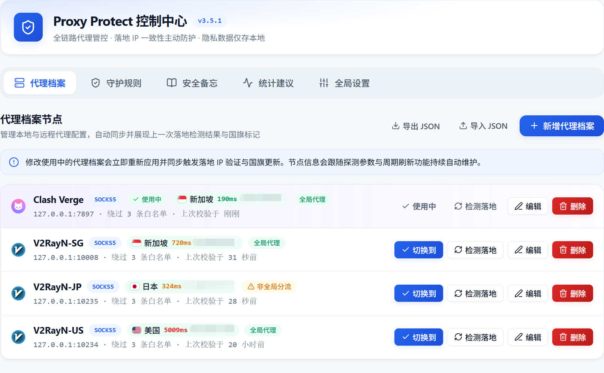
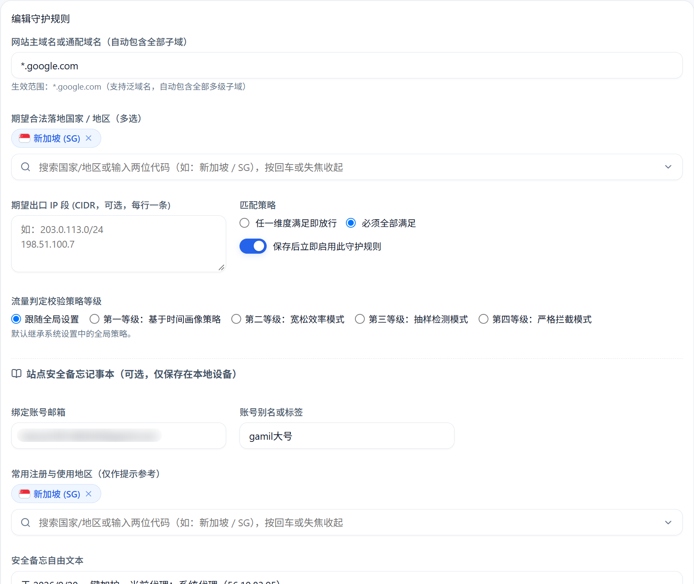
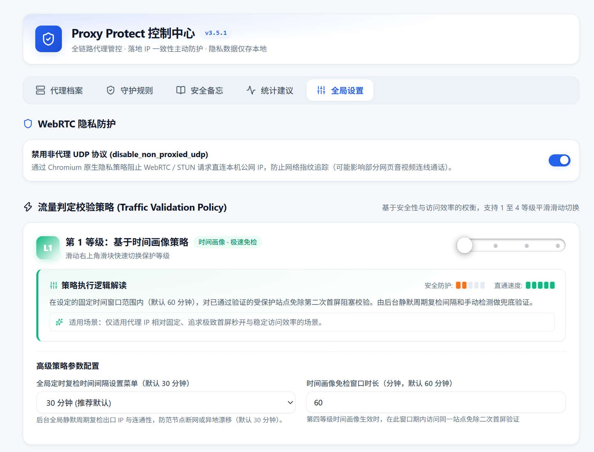
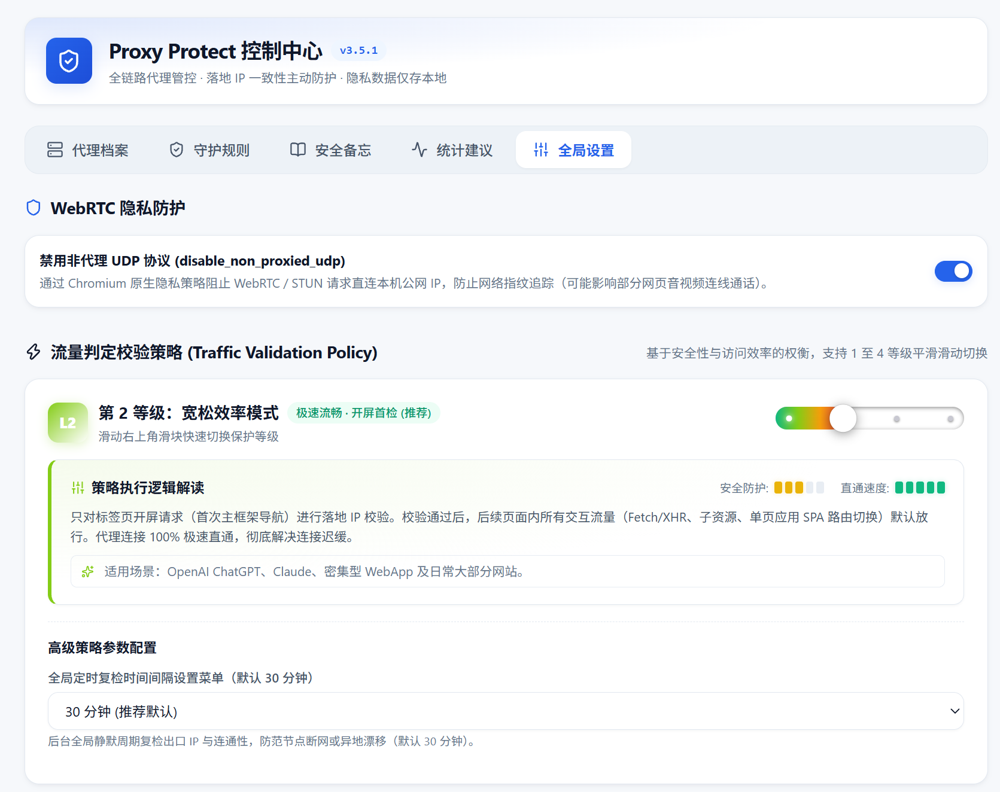
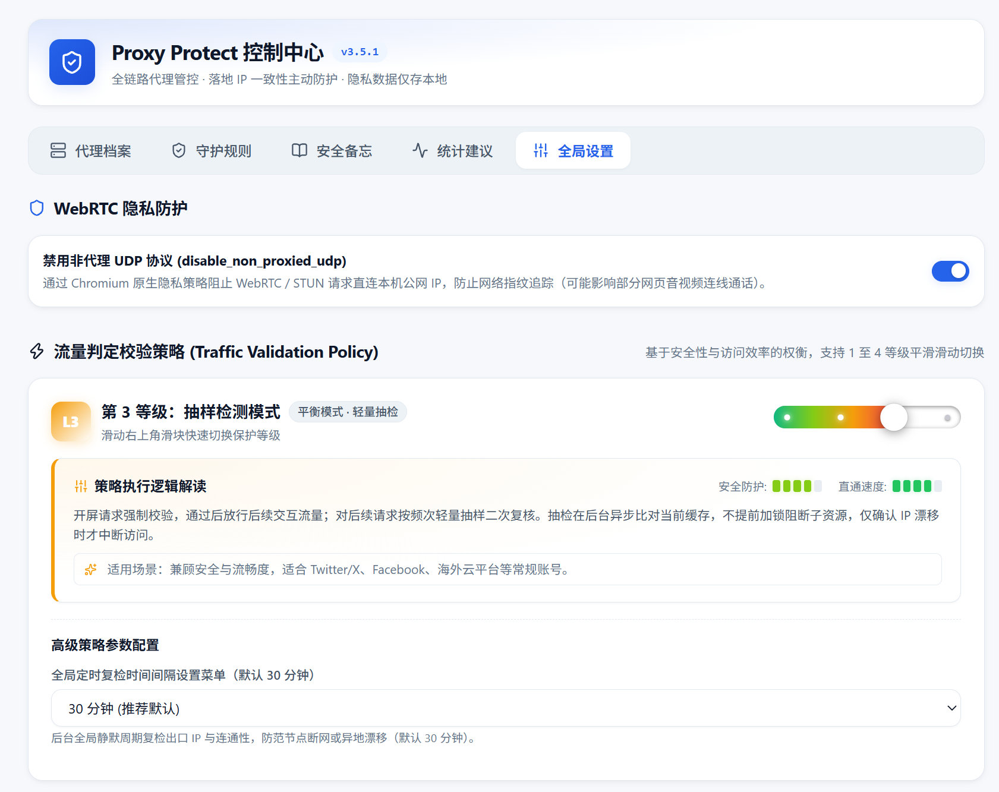
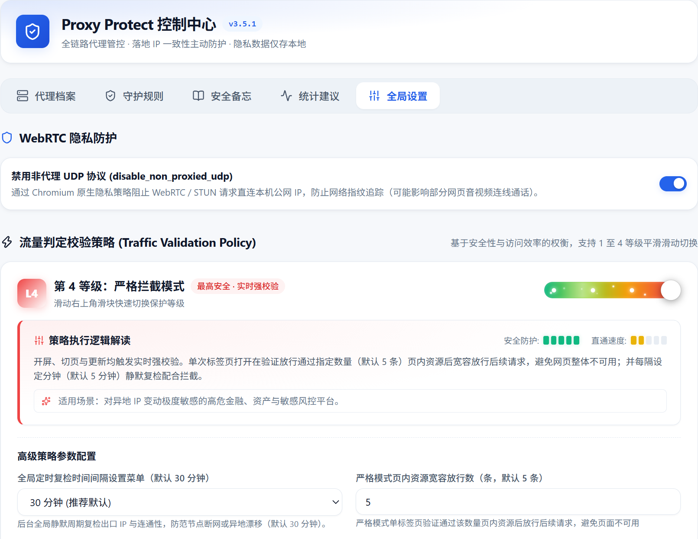
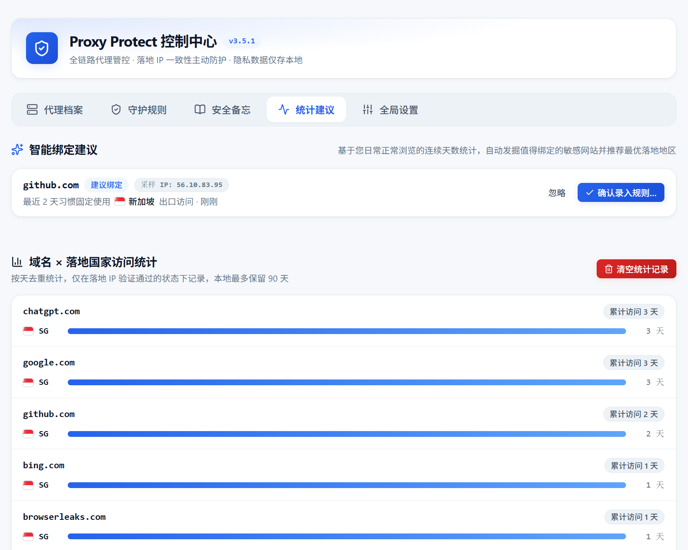
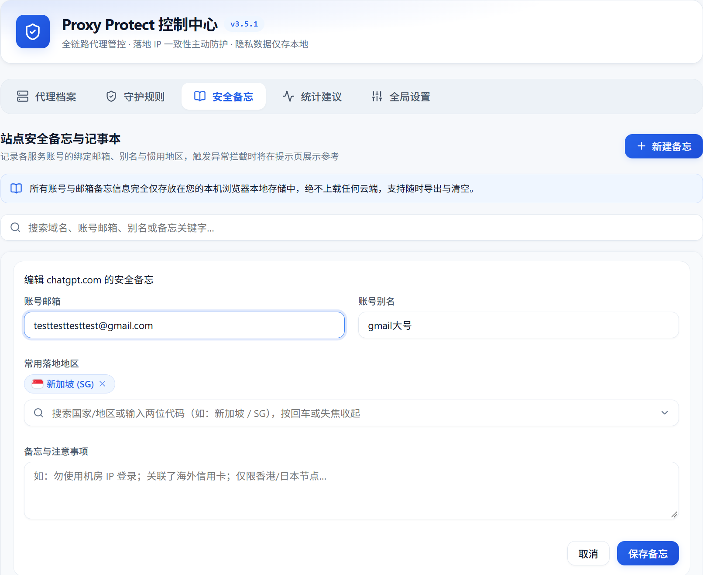
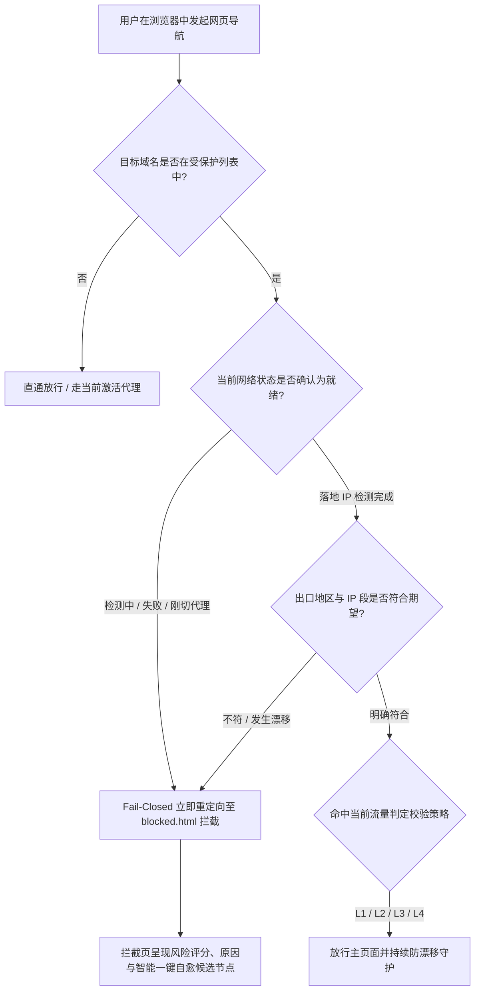

# Proxy Protect - 智能代理切换与域名落地 IP 守护

<div align="center">


**专为跨境运维、海外多平台运营、AI 助手防封设计的浏览器级安全守护扩展**  
在浏览器内毫秒级切换代理，实时核验真实出口 IP 与国家；为敏感站点绑定期望地区，彻底杜绝因节点飘移、断流直连或 WebRTC 泄漏引发的账号风控与封号！

</div>

---

## 📖 核心特性一览

- 🛡️ **Fail-Closed 极速阻断机制**：任何未就绪状态（切代理、浏览器刚启动、检测中、检测失败）下，受保护域名默认保持拦截；只有落地 IP 明确符合期望时才放行，杜绝真实 IP 哪怕 1 毫秒的泄漏穿透。
- 🔒 **Chromium 原生 WebRTC 泄露防护**：原生级封堵 `disable_non_proxied_udp`，彻底根除 STUN/ICE 协议穿透代理导致本机公网真实 IP 暴露给目标网站的隐患。
- ⚡ **四级流量判定校验策略体系 (L1~L4)**：基于安全与性能权衡，提供从“时间画像极速免检”到“ChatGPT Ultra 璀璨流光极限强校验”四档平滑滑动调节体系。
- 🌐 **内外分流与双栈泄露检测**：内建境内外双探针分流探测与 IPv4/IPv6 双栈泄露比对，标记非全局分流风险，并在阻断页生成多因子风控评分。
- 🩺 **智能自愈与一键修复**：在拦截界面智能查找本地可用的合规备选代理节点，一键无缝自愈切换并重定向回原网站。
- 🧠 **本地访问习惯自学习**：全天候本地统计「域名 × 落地国家」，达标后主动弹出高频习惯绑定建议，支持标准国家绑定或严苛 /24 子网IP锁定。
- 📝 **域名安全备忘录**：敏感站点独立绑定账号邮箱、别名、常用出口及备注，数据仅保存于本机本地存储。

---

## 🖼️ 图文全景功能介绍

### 1. 📱 Board 快捷控制面板 (Popup)

点击浏览器右上角插件图标即可唤起轻量微型控制台，支持 0 延迟切换代理节点，实时监视网络出口状态与策略等级。

<div align="center">
  
</div>

- **即时节点直切**：展示内置「直连」、「系统代理」与所有自定义节点，点击即切换并即刻触发网络探针。
- **出口态势直观展示**：大卡片直观显示当前生效的公网出口 IPv4/IPv6、国家旗帜与代码、城市与运营商，以及高精度 **RTT 往返时延**（如 `⚡ 85ms`）。
- **快捷安全状态胶囊**：
  - **⚡ L 等级徽章**：实时显示当前全局流量校验等级，点击直达 `options.html#settings` 全局设置微调滑块；
  - **🛡️ WebRTC 胶囊**：显示非代理 UDP 封锁状态；
  - **⚙️ 顶部齿轮**：一键直达 `options.html#profiles` 代理档案管理页面。

---

### 2. 🌐 代理资料与节点管理 (Profiles)

在控制中心「代理档案」页面中，集中管理所有网络出口节点，具备完整的健康探测、分流审计与快捷配置能力。

<div align="center">
  
</div>

- **全协议兼容**：支持 HTTP、HTTPS、SOCKS4、SOCKS5 代理协议，并提供常用客户端快捷模版（如 V2RayN、Clash 等）。
- **快捷 URL 粘贴解析**：支持粘贴 `socks5://`、`http://` 等标准代理链接，一秒自动解析提取服务器、端口、认证密钥与备注名。
- **代理直切操作**：在档案卡片右侧提供显眼的「切换到」按钮，无需打开弹窗即可在控制中心快速切换生效节点。
- **内外分流检测警示**：自动侦测非全局分流节点，标记 `⚠️ 非全局分流`，规避境内直连导致敏感海外站探测出本地 IP 的风险。
- **全量 JSON 备份与还原**：支持一键导出包含全部节点与备忘录的加密纯文本备份文件，方便多设备迁移。

---

### 3. 🛡️ 域名守护规则配置与编辑 (Rules Edit)

为高价值风控站点（如 OpenAI ChatGPT、Claude、PayPal、Stripe、eBay、X 等）量身打造的防御锁。

<div align="center">
  
</div>

- **通配匹配机制**：输入主域名（如 `chatgpt.com`）即可智能涵盖全部子域名及内嵌 API 服务。
- **国家/地区多选绑定**：支持为站点指定一个或多个允许的出口国家（带真实国旗图标），只有落地国家吻合时才放行。
- **严苛 /24 子网 IP 段绑定**：可填入允许的 CIDR IP 范围（如 `104.28.19.0/24`），实现机房级甚至固定 IP 段的严苛锁定。
- **匹配模式自由切换**：支持「任一满足 (Any)」与「全部满足 (All)」复合条件校验。
- **站点策略独立覆盖**：允许针对单个极端重要站点覆盖全局流量策略，为其单独配置更高级别的校验等级。

---

### 4. ⚡ 四级流量判定校验策略 (Traffic Validation Policy)

基于安全性与访问效率的不同权衡，Proxy Protect 独创了 1~4 等级平滑滑动调控体系：

#### 🟢 第 1 等级：基于时间画像策略 (Time Window)

在设定的时间窗口内（默认 60 分钟），对已验证通过的站点免除二次阻塞校验，最大化保障代理 IP 固定时的丝滑访问体验。

<div align="center">
  
</div>

#### 🟢 第 2 等级：宽松效率模式 (Relaxed - 经典推荐)

专为现代高频交互 WebApp（如 ChatGPT、Claude 等）设计：**仅对新标签页首次开屏请求执行强校验**。一旦首屏放行，页内后续所有 WebSocket、Fetch/XHR 与路由切换均 100% 极速直通，彻底告别打字卡顿与请求迟缓。

<div align="center">
  
</div>

#### 🟡 第 3 等级：抽样检测模式 (Sampling)

开屏导航强制校验，页内交互流量放行后，由后台异步按频次进行轻量抽检复核。不提前加锁阻塞子资源，仅当确认 IP 漂移时才平滑中断访问，兼顾日常安全性与流畅度。

<div align="center">
  
</div>

#### 🔴 第 4 等级：严格拦截模式 (Strict - ChatGPT Ultra 璀璨流光)

最高防护等级：开屏、切页与资源更新均触发实时强校验，配合定时静默复检全面封锁。

<div align="center">
  
</div>

---

### 5. 🧠 统计建议与智能绑定 (Habits & Smart Suggestions)

无需手动繁琐配置，Proxy Protect 在本地后台智能学习用户的网络访问习惯。

<div align="center">
  
</div>

- **纯本地习惯画像**：在默认 5 天的滑动统计窗口中，统计各域名的访问天数与主导落地国家分布。
- **智能策略推荐**：当某域名在 5 天内有 3 天以上稳定使用同一国家访问且占比达到 90% 以上时，主动触发绑定建议。
- **严格度双模式采纳**：
  - **标准国家匹配**：仅将主导国家加入规则，适合动态住宅代理池；
  - **严苛 /24 子网匹配**：基于捕获的出口真实 IP 自动截取前三段（如 `104.28.19.0/24`），防范同一国家跨机房跳池引发的风控。

---

### 6. 📝 域名安全备忘录 (Notes)

专为跨境运营、海外自媒体与独立开发者打造的多账号本地备忘录。

<div align="center">
  
</div>

- **账号身份绑定**：为每个域名记录关联的登录邮箱、账号别名与常用地区，避免多账号串号混淆。
- **一键快捷复制**：集成邮箱快速复制按钮，方便在登录页面秒级粘贴。
- **全本地加密留存**：所有数据严格保留在浏览器的 `chrome.storage.local` 中，绝不上云，绝对隐私安全。

---

## 🛠️ 安装与快速开始

### 方式一：从源码构建并安装

1. **克隆项目到本地**：

   ```bash
   git clone https://github.com/your-username/Proxy-Protect.git
   cd Proxy-Protect
   ```

2. **安装依赖并编译打包**：

   ```bash
   npm install
   npm run build
   ```

   > 编译成功后将在根目录生成 `dist/` 文件夹。

3. **加载到 Chrome / Edge 浏览器**：
   - 打开浏览器访问 `chrome://extensions/`（Edge 访问 `edge://extensions/`）；
   - 在右上角开启「开发者模式」；
   - 点击「加载已解压的扩展程序」，选择项目根目录下的 `dist` 目录；
   - 点击浏览器扩展图标旁边的“图钉”，将 Proxy Protect 固定在浏览器工具栏。

### 开发模式与命令

```bash
npm run dev        # 启动实时监听构建（开发热更模式）
npm test           # 执行 Vitest 单元测试集（49 项用例）
npm run typecheck  # TypeScript 严格静态类型检查
npm run icons      # 自动生成 16/32/48/128 多尺寸高清扩展图标
```

---

## 🛡️ 架构原理与安全模型



1. **Fail-Closed 核心设计**：受保护域名由 Chromium 原生 `declarativeNetRequest` 规则引擎提供持久化底层拦截。在后台 Service Worker 休眠或重启时，拦截规则依然持续生效，绝不出现任何毫秒级空档泄露。
2. **纯粹的本地隐私**：插件不依赖任何第三方远程后端服务，所有代理配置、账号备忘录与历史访问习惯仅存储于本机 Chrome Local Storage。

---

## 📄 开源许可证

本项目基于 [MIT License](LICENSE) 协议开源。
