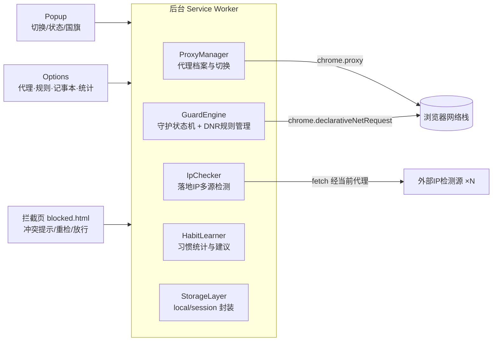
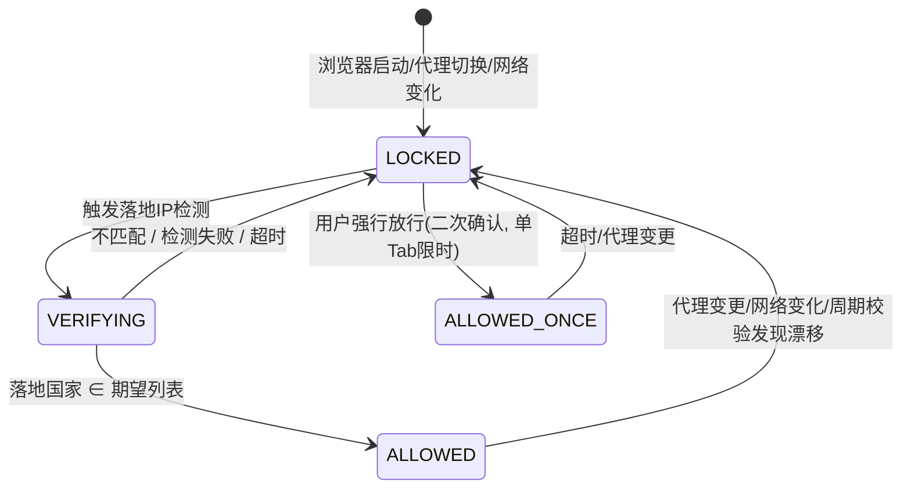

# Proxy-Protect 浏览器代理切换与域名守护插件 —— 开发计划

> 版本：v1.0（2026-09-04）
> 目标平台：Chrome / Edge（Chromium 内核，Manifest V3），后续可扩展 Firefox

---

## 1. 项目概述

Proxy-Protect 是一款浏览器扩展，核心解决两个问题：

1. **代理切换**：在浏览器内快速切换上游代理（HTTP / SOCKS4 / SOCKS5），并实时检测代理的**实际落地 IP** 与所属国家（显示国旗）。
2. **域名-IP 一致性守护**（本插件的差异化核心）：针对对登录 IP 敏感的网站（如 ChatGPT），记录"该域名习惯使用哪个国家/地区的落地 IP"，当**当前落地 IP 与该域名的绑定区域不一致**时，**先中断对该域名的访问**，等待代理恢复正常后再自动放行，避免账号因 IP 漂移触发风控。

典型场景：用户的 ChatGPT 账号长期使用新加坡 IP。某天代理意外切到了美国节点，用户没注意就打开了 chatgpt.com——Proxy-Protect 会在请求发出前拦截，展示"当前落地 IP 为 US，期望 SG"的提示页，同时展示用户在记事本中记录的账号邮箱与常用区域备注；用户切回新加坡节点、检测通过后，页面自动放行并跳回原地址。

---

## 2. 需求梳理

### 2.1 功能需求

| 编号 | 功能 | 说明 | 优先级 |
|------|------|------|--------|
| F1 | 代理配置管理 | 增删改查代理档案（Profile），支持 HTTP / HTTPS / SOCKS4 / SOCKS5，支持用户名密码（见 4.1 限制说明）、bypass 白名单、导入导出 | P0 |
| F2 | 一键切换代理 | Popup 中点选即生效；支持"直连"与"系统代理"两个内置模式；工具栏角标显示当前状态 | P0 |
| F3 | 落地 IP 检测 | 切换代理后自动检测出口 IP、国家/地区、ISP；多检测源容灾；Popup 显示 IP + 国旗，角标显示国家代码（如 SG） | P0 |
| F4 | 域名守护规则 | 为指定域名（支持通配，如 `*.chatgpt.com`）绑定期望国家/地区（可多选）或指定 IP 段；不一致时拦截该域名请求，一致时放行 | P0 |
| F5 | 冲突拦截页 | 被拦截时跳转到插件内置提示页：展示当前落地 IP/国家 vs 期望值、该域名的记事本备注、「重新检测」「切换代理」按钮，以及需二次确认的「本次强行放行」逃生口；恢复后自动跳回原页面 | P0 |
| F6 | 使用习惯学习 | 正常状态下自动记录「域名 ↔ 落地国家」的访问统计；对高频且未绑定的域名，提示用户一键创建守护规则（如"您最近 14 天访问 chatgpt.com 均使用 SG，是否绑定？"） | P1 |
| F7 | 站点记事本 | 每个守护域名可附加备注：账号邮箱、账号别名、常用 IP 区域、自由文本；在 Popup、拦截页中展示 | P1 |
| F8 | 设置项 | 检测源选择与自定义、检测超时/重试、失败策略（默认 fail-closed）、开机自检、通知开关 | P1 |
| F9 | 数据安全 | 记事本含邮箱等敏感信息：本地存储，支持可选主密码加密（AES-GCM）；导出文件支持加密 | P2 |
| F10 | 国际化与主题 | 中/英双语，暗色模式 | P2 |

### 2.2 非功能需求

- **安全优先（fail-closed）**：任何"不确定"状态（检测中、检测失败、刚切换代理、浏览器刚启动）下，受保护域名一律默认拦截，绝不出现"错误 IP 访问敏感站点"的窗口期。
- **拦截必须同步生效**：不能依赖异步回调放行/拦截（存在竞态），需用声明式规则保证。
- **低打扰**：非守护域名完全不受影响；守护域名在 IP 正确时无感知。
- **可恢复**：MV3 Service Worker 随时可能休眠，所有状态必须可从存储恢复，拦截规则不依赖 SW 存活。

---

## 3. 技术选型

| 项 | 选择 | 理由 |
|----|------|------|
| 扩展规范 | Manifest V3 | Chrome 商店强制要求 |
| 语言 | TypeScript | 类型安全，规则引擎逻辑较复杂 |
| 构建 | Vite + @crxjs/vite-plugin | 热更新友好，多入口（popup/options/blocked）打包简单 |
| UI 框架 | Preact（或 React） | Popup/Options/拦截页均为小型 SPA，体积敏感选 Preact |
| 状态存储 | chrome.storage.local（配置、规则、记事本）+ chrome.storage.session（运行时验证状态） | session 区在浏览器关闭后清空，天然符合"重启后需重新验证"的 fail-closed 语义 |
| 代理控制 | chrome.proxy.settings（mode: fixed_servers / direct / system） | 官方 API，原生支持 http/https/socks4/socks5 scheme |
| 请求拦截 | chrome.declarativeNetRequest 动态规则（redirect 到拦截页 / block） | MV3 下唯一的同步拦截手段，且规则持久、不依赖 SW 存活 |
| 代理认证 | chrome.webRequest.onAuthRequired + webRequestAuthProvider 权限 | MV3 下为 HTTP(S) 代理提供用户名密码 |
| IP 归属地 | 多源：ip-api.com、ipwho.is、api.ip.sb、ipinfo.io（可配置自定义源） | 单源可能被墙/限流，串行降级 + 结果交叉校验 |
| 国旗展示 | 国家代码 → Emoji 旗帜（🇸🇬），拦截页/Options 另备 flag-icons SVG | 零资源成本，SVG 兜底 Windows 上 Emoji 旗帜显示问题 |
| 单元测试 | Vitest | 与 Vite 同生态 |

### 3.1 必须提前明确的平台限制（可行性结论）

1. **SOCKS5 认证**：Chromium 的 SOCKS5 实现**不支持用户名密码认证**（`onAuthRequired` 只覆盖 HTTP 代理 407 认证）。
   - 应对：无认证 SOCKS4/5 完整支持；带认证的 SOCKS5 在 UI 中明确提示限制，文档建议用本地转换工具（gost/privoxy 等）中转，或后续版本提供 Native Messaging 伴侣程序（见 §11 路线图）。
2. **MV3 无阻塞式 webRequest**：普通扩展不能用 `webRequest` blocking 拦截，必须用 declarativeNetRequest（DNR）。DNR 规则是声明式、同步命中的，正好满足 fail-closed。
3. **代理控制权竞争**：其他扩展或企业策略可能抢占 proxy 设置。需读取 `levelOfControl` 并在 UI 中明确告警"当前代理不受本插件控制"。
4. **检测请求自身的路由**：扩展后台发出的 `fetch` 同样走浏览器代理设置，因此可以直接检测"浏览器视角"的落地 IP；但需保证 DNR 拦截规则**排除**检测源域名（用 `initiator` 域限定 + excludedRequestDomains 双保险）。

---

## 4. 系统架构



模块职责：

- **ProxyManager**：代理档案 CRUD；调用 `chrome.proxy.settings.set()` 应用 `fixed_servers`（按 scheme 生成 `socks5://host:port` 等 singleProxy 配置）；维护 bypassList；处理 `onAuthRequired` 提供 HTTP 代理凭据；监听 `levelOfControl`。
- **IpChecker**：代理生效后（含浏览器启动、网络变化 `navigator.onLine`、手动触发、alarms 周期性校验）串行请求检测源，超时 5s 降级下一源；输出 `{ip, countryCode, city, isp, source, checkedAt}` 写入 storage.session；通知 GuardEngine 与 UI。
- **GuardEngine**：核心状态机（见 §5.3）。根据「验证状态 × 每条守护规则」计算应启用的 DNR 动态规则集合，原子化增删规则；管理拦截页跳转参数与恢复放行后的自动回跳。
- **HabitLearner**：在「验证通过」状态下，监听 `webNavigation.onCommitted`，对访问的域名记录 `(eTLD+1, countryCode, date)` 去重统计；产出绑定建议。
- **StorageLayer**：统一读写、schema 版本迁移、可选加密（WebCrypto）。

### 4.1 权限清单（manifest.json）

```json
{
  "permissions": [
    "proxy", "storage", "declarativeNetRequest",
    "webRequest", "webRequestAuthProvider",
    "alarms", "tabs", "webNavigation", "notifications"
  ],
  "host_permissions": ["<all_urls>"]
}
```

> `<all_urls>` 用于代理认证与 DNR 全域名匹配；商店审核说明中需逐条解释用途。

---

## 5. 核心方案设计

### 5.1 代理切换（F1/F2）

- `fixed_servers` + `singleProxy: { scheme: "http" | "https" | "socks4" | "socks5", host, port }`。
- bypassList 默认包含 `localhost;127.0.0.1;<local>`，用户可追加。
- 内置两个特殊档案：**直连**（mode: direct）、**系统代理**（mode: system）。
- 切换动作是一个事务：`应用代理设置 → 使全部守护域名进入锁定 → 触发落地 IP 检测`，三步由 GuardEngine 统一编排，杜绝中间态。
- 角标（badge）：显示当前档案缩写或落地国家代码；检测中显示 `…`，失败/锁定显示 `!`（红底）。

### 5.2 落地 IP 检测与国旗（F3）

- 检测源接口统一适配为 `fetch(url) → {ip, countryCode}`，内置 4 个公共源 + 支持用户自定义 URL（JSON 路径映射）。
- 触发时机：代理切换后、浏览器启动、`chrome.alarms` 周期校验（默认 10 分钟，可关）、网络状态变化、用户手动点击、拦截页「重新检测」。
- 结果缓存于 `storage.session`，带 `proxyProfileId` 指纹——**换代理即失效**，防止旧结果误放行。
- 国旗：`countryCode → Regional Indicator Emoji` 工具函数；拦截页与列表另用本地 SVG（flag-icons 子集，仅打包常用 ~60 国 + 动态兜底）。

### 5.3 域名守护状态机（F4/F5，核心）

每条守护规则 `ProtectedSite` 的运行时状态：



**fail-closed 实现关键**：

1. `LOCKED` 状态 = 存在一条 DNR 动态规则：`urlFilter: ||chatgpt.com^`，`action: redirect` 到 `blocked.html?site=...&from=<原URL>`（对 main_frame）；对 sub_frame/xhr 等子资源则直接 `block`。规则写入后由浏览器同步执行，与 SW 是否存活无关。
2. 状态转换只有一个方向是"删规则"（放行），且必须发生在**拿到与当前代理指纹匹配的检测结果**之后——不存在"先放行再检测"的路径。
3. 浏览器启动时（`runtime.onStartup`/SW 冷启动）：因为 `storage.session` 已清空、验证状态丢失，GuardEngine 首个动作就是给所有启用的守护规则**重建 LOCKED 规则**，再发起检测。
4. 匹配逻辑：`expectedCountries`（如 `["SG"]`）为主；进阶支持 `expectedIpRanges`（CIDR，适合自建固定出口）。两者满足其一即可放行（可配置为"同时满足"）。

**拦截页（blocked.html）内容**：

- 醒目状态区：当前落地 `🇺🇸 US 104.28.x.x` ✗ → 期望 `🇸🇬 SG`；
- 该域名记事本卡片：账号邮箱（默认打码，点击显示）、常用区域、自由备注；
- 操作：「重新检测」「打开代理切换面板」「强行放行本次（10 分钟，仅当前标签页，需输入确认）」；
- 后台检测通过后，通过 `tabs.onUpdated`/消息推送自动 `location.replace(原URL)` 回跳。

### 5.4 习惯学习（F6）

- 仅在 `ALLOWED` 或非守护域名 + 检测结果新鲜（< 30 min）时记录：`{domain(eTLD+1), countryCode, date}`，按天去重，本地环形保留 90 天。
- 建议触发条件（默认，可调）：某域名近 14 天内 ≥ 5 个不同日期访问，且 ≥ 90% 使用同一国家，且未创建规则 → 通知/Popup 提示一键绑定。
- 隐私：纯本地统计，不上传；可一键清空；域名级黑名单（不统计）。

### 5.5 站点记事本（F7/F9）

- 数据挂在 `ProtectedSite.note` 上；未创建守护规则的域名也可单独建纯备注条目。
- 字段：邮箱、账号别名、常用区域（国家多选）、自由文本、更新时间。
- 可选主密码：开启后用 PBKDF2 派生密钥 + AES-GCM 加密 note 字段；解锁状态保存在 `storage.session`（浏览器关闭即锁定）。

### 5.6 数据模型（storage schema v1）

```ts
interface ProxyProfile {
  id: string; name: string; color: string;
  scheme: 'http' | 'https' | 'socks4' | 'socks5';
  host: string; port: number;
  auth?: { username: string; password: string }; // socks5 认证在 UI 标注不支持
  bypassList: string[];
}
interface ProtectedSite {
  id: string;
  domainPattern: string;          // 如 chatgpt.com（自动含子域）
  expectedCountries: string[];    // ISO 3166-1 alpha-2
  expectedIpRanges?: string[];    // CIDR，可选
  matchMode: 'any' | 'all';
  enabled: boolean;
  note?: SiteNote;
}
interface SiteNote { email?: string; alias?: string; regions?: string[]; text?: string; updatedAt: number; }
interface ExitIpResult { ip: string; countryCode: string; city?: string; isp?: string; source: string; checkedAt: number; proxyProfileId: string; }
interface HabitRecord { domain: string; countryCode: string; dates: string[]; }
interface Settings { checkers: CheckerConfig[]; timeoutMs: number; recheckMinutes: number; failPolicy: 'closed'; locale: 'zh' | 'en'; theme: 'auto' | 'dark' | 'light'; }
```

---

## 6. UI 设计要点

| 界面 | 内容 |
|------|------|
| Popup（~360×520） | ① 顶部状态卡：当前档案名、落地 IP、国旗、ISP、「重新检测」；② 代理档案列表（点击切换，含直连/系统）；③ 守护站点状态行：每条规则 绿✓匹配 / 红🔒锁定 / 灰-检测中；④ 底部：进入 Options、暂停守护 5 分钟（需确认） |
| Options | 四个 Tab：代理管理（表单校验、连通性测试、导入导出 JSON）、守护规则（域名、期望区域多选国旗选择器、匹配模式、启停）、记事本（列表 + 搜索 + 加密开关）、统计与建议（习惯图表、一键绑定、清空数据）、设置 |
| blocked.html | 见 §5.3；同时承担"检测失败"提示（区分「IP 不匹配」和「无法确认落地 IP」两种文案） |

---

## 7. 里程碑与排期（1 人全职，约 4 周）

| 阶段 | 内容 | 产出/验收标准 | 预估 |
|------|------|--------------|------|
| M0 脚手架 | Vite+CRXJS+TS+Preact 工程、manifest、CI（lint+vitest）、基础 StorageLayer | 空扩展可加载，三入口页面可打开 | 1 天 |
| M1 代理切换 | ProxyProfile CRUD、fixed_servers 应用、直连/系统模式、bypass、HTTP 认证、badge、levelOfControl 告警 | 手动配置 HTTP 与 SOCKS5 代理均可生效并正常上网；认证代理可用 | 4 天 |
| M2 落地 IP + 国旗 | IpChecker 多源适配与降级、结果缓存与指纹、Popup 状态卡、国旗渲染、alarms 周期校验 | 切换代理 3s 内显示正确落地国家；断网/检测源全挂时明确报"未知"状态 | 3 天 |
| M3 域名守护 | GuardEngine 状态机、DNR 规则原子管理、blocked.html、强行放行、自动回跳、启动时重建锁定 | 核心验收：代理为 US 时打开 chatgpt.com 100% 被拦截（含冷启动、SW 被杀后）；切回 SG 检测通过后自动回跳原页面 | 5 天 |
| M4 习惯 + 记事本 | HabitLearner 统计与建议通知、记事本 CRUD、拦截页/Popup 展示备注、可选加密 | 模拟 14 天数据可触发绑定建议；备注在拦截页正确展示、加密后重启需解锁 | 4 天 |
| M5 打磨发布 | 导入导出、i18n（zh/en）、暗色模式、边界测试清单、图标与商店素材、隐私政策、打包上架 | 通过 §8 测试清单；Chrome 商店提交 | 3 天 |

> 缓冲 2~3 天应对 Chromium 代理行为的实测偏差（尤其 SOCKS 场景与 DNR 优先级）。

---

## 8. 测试计划

**单元测试（Vitest）**：国家匹配/CIDR 匹配、DNR 规则生成器（给定规则集+状态 → 期望规则数组）、检测源响应解析、习惯统计聚合、状态机转换表全覆盖。

**集成/手动测试清单（需真实代理环境：至少 1 个 SG 节点 + 1 个非 SG 节点 + 1 个带认证 HTTP 代理）**：

1. 四种 scheme 各自切换后可正常浏览，`chrome://net-internals` 无泄漏直连；
2. 落地 IP 与代理商后台显示一致，国旗正确；
3. 守护竞态：切换代理后**立即**（<100ms）打开受保护域名 → 必须被拦截；
4. 冷启动：设置 SG 绑定 → 关闭浏览器 → 换成 US 节点 → 启动浏览器立即访问 chatgpt.com → 必须被拦截；
5. SW 休眠：空闲 5 分钟后直接访问受保护域名 → 规则仍生效；
6. 检测源全部超时 → 保持锁定并提示「无法确认落地 IP」；
7. 强行放行：仅当前标签页、10 分钟后自动失效；
8. 子资源拦截：其他网站内嵌 chatgpt.com iframe/xhr 在锁定期被 block 且不弹拦截页；
9. 检测请求不被自身 DNR 规则误伤；
10. 其他代理扩展抢占控制权时的告警展示。

---

## 9. 风险与对策

| 风险 | 影响 | 对策 |
|------|------|------|
| Chromium 不支持带认证的 SOCKS5 | 部分付费代理无法直连使用 | UI 明确提示 + 文档给出本地中转方案；v2 规划 Native Messaging 伴侣进程做本地转换 |
| 公共 IP 检测源被墙/限流/返回不准 | 误锁定或无法解锁 | 多源降级 + 自定义源 + 交叉校验；失败一律 fail-closed 并给出清晰文案，绝不误放行 |
| DNR 规则与放行竞态 | 出现错误 IP 访问窗口 | 只有"检测结果指纹 == 当前代理"才删规则；切换代理第一步先加锁 |
| MV3 SW 生命周期 | 状态丢失 | 拦截由持久 DNR 规则兜底；验证状态放 storage.session，冷启动默认全锁 |
| WebRTC/DNS 泄漏影响"真实落地" | 站点看到的 IP 与检测不一致 | 设置页提供 `webRTCIPHandlingPolicy` 一键收紧（chrome.privacy）+ 泄漏自测入口 |
| 商店审核（宽权限） | 上架被拒 | 权限逐条说明、隐私政策声明全部数据本地存储、提供最小化演示视频 |

---

## 10. 交付物与目录结构

```
Proxy-Protect/
├── manifest.config.ts          # CRXJS manifest 源
├── src/
│   ├── background/
│   │   ├── index.ts            # SW 入口：事件注册与编排
│   │   ├── proxy-manager.ts
│   │   ├── ip-checker.ts
│   │   ├── guard-engine.ts     # 状态机 + DNR 规则管理
│   │   └── habit-learner.ts
│   ├── pages/
│   │   ├── popup/              # Preact SPA
│   │   ├── options/
│   │   └── blocked/            # 拦截提示页
│   ├── shared/
│   │   ├── types.ts  storage.ts  countries.ts  flags.ts  matchers.ts
│   └── assets/flags/           # SVG 国旗子集
├── tests/                      # Vitest
├── docs/                       # 使用说明、隐私政策、审核材料
└── 开发计划.md                  # 本文件
```

---

## 11. 后续路线图（v2+，不在本期范围）

- Native Messaging 伴侣程序：支持带认证 SOCKS5、代理链、延迟测速；
- Firefox 移植（`proxy.onRequest` 可实现按域名分流，能力更强）；
- 按域名自动切换代理（PAC 生成器）：守护规则升级为"访问 chatgpt.com 自动切到 SG 档案"；
- 订阅导入（Clash/通用格式）；
- 多浏览器 Profile 间配置同步（加密云备份）。
